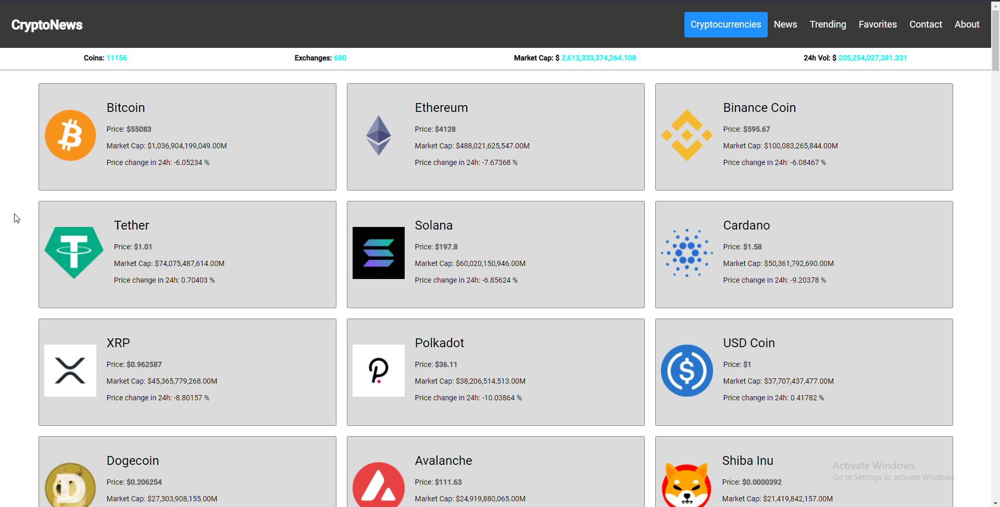
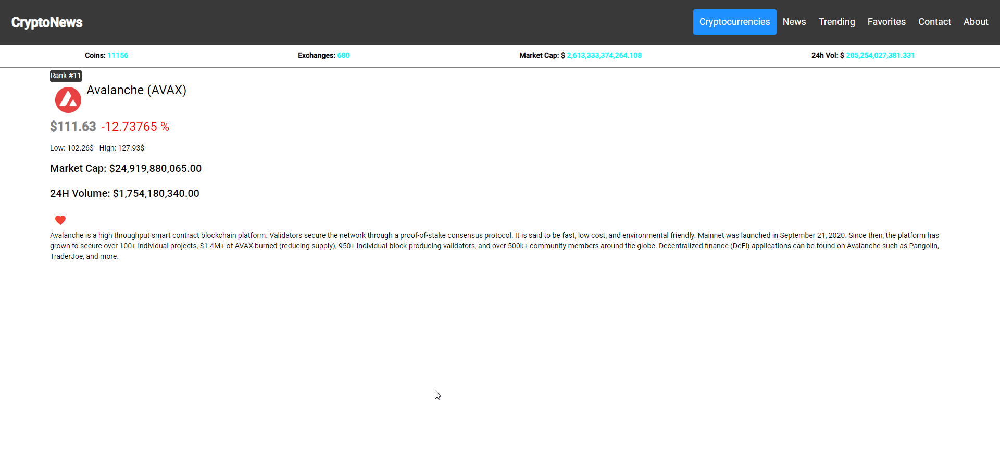
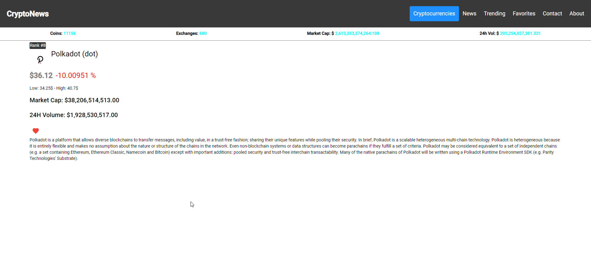
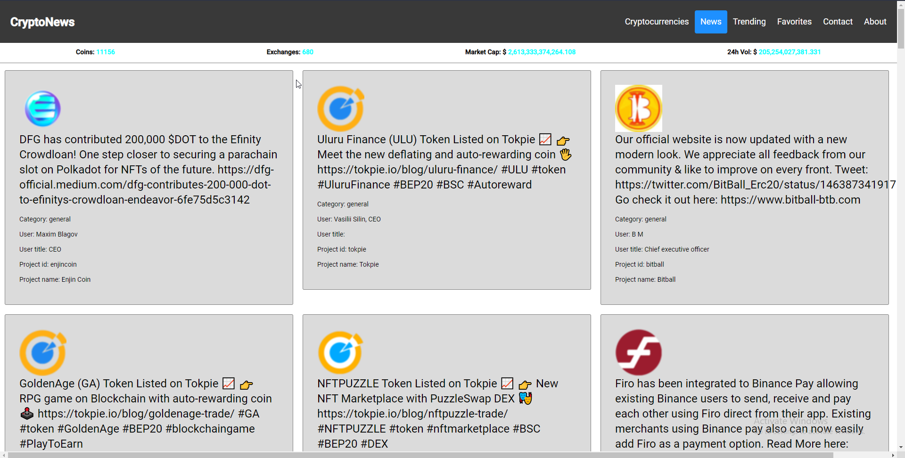
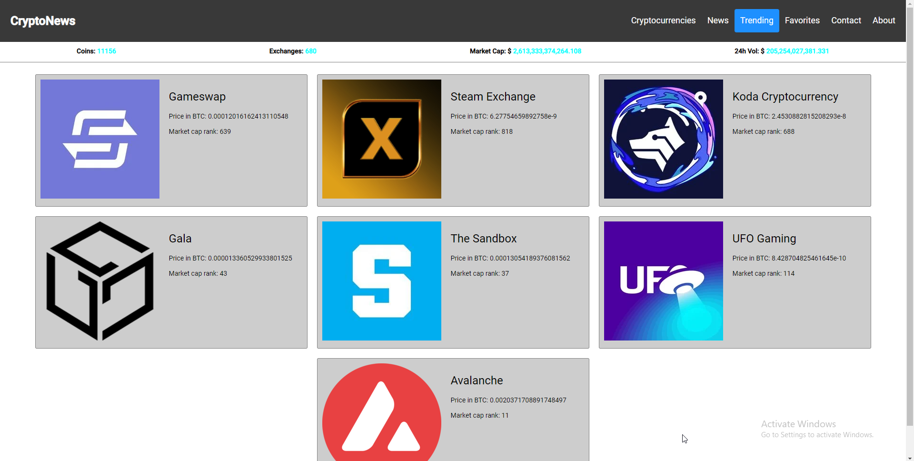
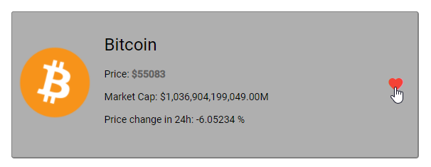
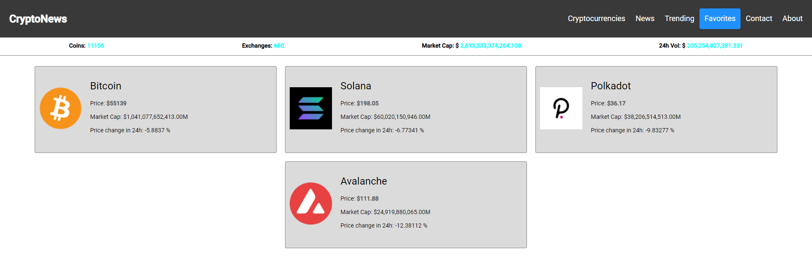

# CryptoNews
CryptoNews is a frontend application made with Angular, using the API of CoinGecko to display the most important data for the crypto world.

This is the initial listing of the cryptocurrencies

This is the screen that gets loaded when you click on any of the coins where you can see more data about it

News page where you can see the most recent new in the crypto world 

Top 7 trending coins

Add to favorites

Favorites screen

